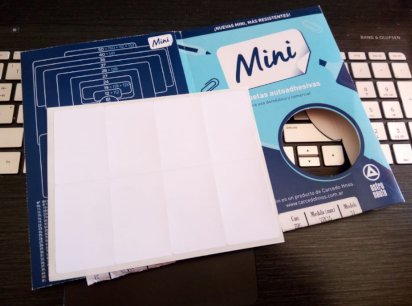
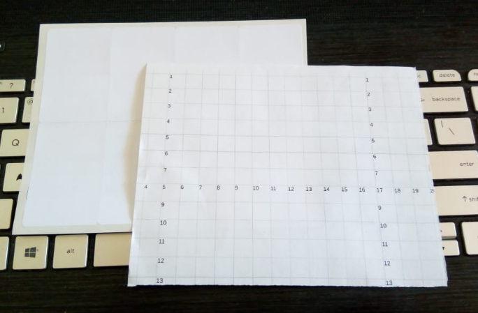

# Proyecto Paperform

[Volver](?)

## ¿En qué consiste la app?

La idea de la app es ayudarnos a crear "formularios" en los que colocar textos e
imágenes, de forma que sepamos de antemano que al imprimirlos caerán en el lugar
correcto de nuestra plantilla de etiquetas autoadhesivas.

La idea es poder usarla con cualquier plantilla de etiquetas, por ejemplo, estas
etiquetas que son muy baratas:

### Versión online

La app de paperform va a estar alojada en: [https://paperform.ip1.cc]
(https://paperform.ip1.cc).
Por ahora sólo hay una versión no funcional que tiene lo desarrollado hasta
ahora.

La idea es que la app empiece por ayudarte a imprimir una grilla como esta:

La imprimirías en un papel del mismo tamaño exacto que la plantilla de etiquetas
(o usarías la plantilla si tenés muchas y no te importa desperdiciar una) y
mirando la grilla numerada, ubicarías en la pantalla los "cuadrados" que marcan
donde está cada etiqueta en la grilla.

Luego ponés invisible la grilla, y te quedan los cuadrados, pero ésos no son
imprimibles, es decir que si mandás a imprimir con sólo los cuadrados, no sale
nada.

Una vez que te tomaste el trabajo de ubicar los cuadrados ya tenés hecha la
plantilla.  La podés grabar para usos futuros.
Al grabarla te da un url nuevo que podés poner en favoritos cuando la quieras
usar.

El último paso es el de usar la grilla, es decir, imprimir las etiquetas:
Para eso insertás el contenido, que es imprimible.
Lo insertás guiándote por los cuadrados que tiene la plantilla.

No sólo la plantilla es grabable.  También podés grabar la plantilla con
contenido.  Esto es útil para repetir impresiones similares en el futuro.

Opciones para ingresar contenido: Texto, formas geométricas básicas, e imágenes
(uploads o tomadas de Internet).  Todo redimensionable y rotable.
